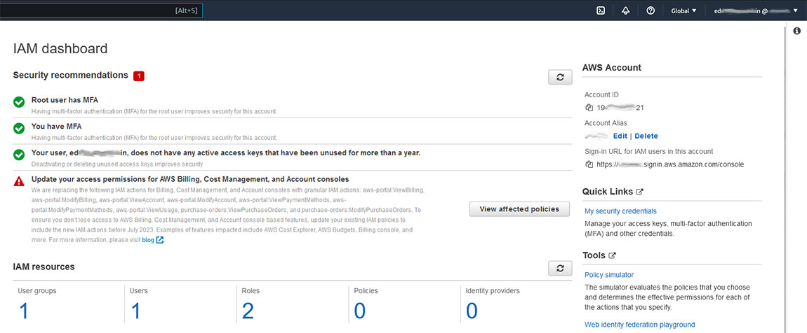

# Week 0 — Billing and Architecture

## General description

This week we will set up AWS account, register in a few services needed to implement this bootcamp, initiate our github repository based on Andrew template and begin to familiarize ourselves with the bootcamp stuff and tools.

## First steps

- [x] [Create an AWS account](#create-an-AWS-account-and-secure-root-account). (https://aws.amazon.com).
- [x] [Secure root account](#create-an-aws-account-and-secure-root-account).
- [x] [Create an AWS IAM user](#create-aws-iam-user).
- [x] [Secure IAM user account](#secure-iam-user-account).
- [x] [Create a billing alarm](#create-sns-topic--alarm).
- [x] [Create a budget](#budget-and-notifications).
- [x] [Create EventBridge rule for a service health issue](#create-eventbridge-rule-for-a-service-health-issue).
- [ ] Open a support ticket and request a service limit at *AWS Console -> Support center -> Create case -> Looking for service limit increases?*.
- [X] Create a Github repository (https://www.github.com).
- [X] Login into Gitpod with github account and create a Gitpod workspace (https://www.gitpod.io).
- [x] Explore github.com/codespaces as an alternative of a CDE.
- [x] Momento: obtain AWS token and configure cli (https://www.gomomento.com).
- [X] Create Lucidchart account (https://www.lucidchart.com).
- [X] Create a free-tier Honeycomb account (https://www.honeycomb.io).
- [X] Create a free-tier Rollbar account (https://www.rollbar.com).
- [x] [Draft & conceptual diagram](#draft--conceptual-diagram).
- [x] [Logical Architectural diagram](#logical-architectural-diagram).
- [ ] [CI/CD Pipeline diagram](#architectural-diagram-of-cicd-logical-pipeline).
- [x] [Review all the questions of each pillars in the Well Architected Tool](#aws-well-architected-tool).

## Create an AWS account and secure root account.


[Go to first steps](#first-steps)

## Create AWS IAM user


[Go to first steps](#first-steps)

## Secure IAM user account



[Go to first steps](#first-steps)

## Draft & Conceptual diagram
Application functionality of what we plan to build during this bootcamp. Handmade draft.


Application conceptual diagram done with Lucidchart tool.<br>
[Conceptual diagram](https://lucid.app/lucidchart/180975ca-39a8-46b8-819b-ef3b739c2e84/edit?viewport_loc=-697%2C-279%2C2219%2C1079%2C0_0&invitationId=inv_af5c5e86-1b85-4256-8f4e-59f8ce56e120)


[Go to first steps](#first-steps)

## Logical Architectural diagram
Application architectural diagram done with Lucidchart tool.<br>
[Architectural diagram](https://lucid.app/lucidchart/bfc979f9-1407-4586-9006-694825740f7f/edit?viewport_loc=125%2C108%2C2219%2C1079%2C0_0&invitationId=inv_17a61a89-4d6b-444c-99c0-acbc7c45b727)


[Go to first steps](#first-steps)

## Architectural diagram of CI/CD logical pipeline

==todo: add diagram image===

[Go to first steps](#first-steps)

## Install aws-cli
There are many options to work with aws-cli. **gitpod automatically** is the method that will be implemented.

### On local machine
Installing as a normal user following this commands:

```
$ curl "https://awscli.amazonaws.com/awscli-exe-linux-x86_64.zip" -o "awscliv2.zip"
$ unzip awscliv2.zip
$ cd aws
$ ./install -i ~/.local/aws-cli -b ~/.local/bin
```

Re-login and command **aws** is available.
Now is time to configure aws-cli with ENV VARS or aws command:

```
$ export AWS_ACCESS_KEY_ID="[AWS_ACCESS_KEY]"
$ export AWS_SECRET_ACCESS_KEY_ID="[AWS_SECRET_ACCESS_KEY]"
$ export AWS_DEFAULT_REGION="[AWS_REGION]"

or 

$ aws configure
AWS Access Key ID [None]: [AWS_ACCESS_KEY]
AWS Secret Access Key [None]: [AWS_SECRET_ACCESS_KEY]
Default region name [None]: [AWS_REGION]
Default output format [None]: 
```
Test configuration:

```
$ aws sts get-caller-identity
{
    "UserId": "[USER_ID]",
    "Account": "[ACCOUNT_ID]",
    "Arn": "arn:aws:iam::[ACCOUNT_ID]:user/[NAME]"
}
```


### On gitpod automatically
We need to use this implementation to keep the changes when the workspace is closed and opened again.
Installing with a task adding the following in .gitpod.yml:

```
tasks:
  - name: aws-cli
    env:
      AWS_CLI_AUTO_PROMPT: on-partial
    init: |
      cd /workspace
      curl "https://awscli.amazonaws.com/awscli-exe-linux-x86_64.zip" -o "awscliv2.zip"
      unzip awscliv2.zip
      sudo ./aws/install
      cd $THEIA_WORKSPACE_ROOT
```

Now aws configuration steps are required. To keep env variables to later use we have to replace **export** with **gp env**

```
$ gp env AWS_ACCESS_KEY_ID="[AWS_ACCESS_KEY]"
$ gp env AWS_SECRET_ACCESS_KEY_ID="[AWS_SECRET_ACCESS_KEY]"
$ gp env AWS_DEFAULT_REGION="[AWS_REGION]"
```

### On gitpod manually
Installing following this commands on gitpod terminal:

```
gitpod /workspace/aws-bootcamp-cruddur-2023 (main) $ cd
gitpod ~ $ cd /workspace
gitpod /workspace $ curl "https://awscli.amazonaws.com/awscli-exe-linux-x86_64.zip" -o "awscliv2.zip"
gitpod /workspace $ unzip awscliv2.zip
gitpod /workspace $ sudo ./aws/install
gitpod /workspace $ cd $THEIA_WORKSPACE_ROOT
```

Now aws configuration steps are required.

[Go to first steps](#first-steps)

## Create SNS Topic & Alarm

### SNS Topic
Documentation about creating sns topic: https://docs.aws.amazon.com/cli/latest/reference/sns/create-topic.html

First we create a topic with aws command line:

```
$ aws sns create-topic --name billing-alarm
```

The result can be seen on Amazon SNS:


Then we create a subscription with this TopicARN and email:

```
$ aws sns subscribe \
    --topic-arn [TopicARN] \
    --protocol email \
    --notification-endpoint [EMAIL]
```

This action create a subscription with pending state:


The user will get an email with subscription request:


Request confirmation:


Then we can see that state changed to confirmed. The user now can received emails from this topic.


[Go to first steps](#first-steps)

### Alarm
Documentation about monitor daily EstimatedCharges and trigger a CloudWatch alarm: https://aws.amazon.com/premiumsupport/knowledge-center/cloudwatch-estimatedcharges-alarm/ <br>
Documentation about creating a metric alarm: https://docs.aws.amazon.com/cli/latest/reference/cloudwatch/put-metric-alarm.html

First we need to create json file: **alarm-config**<br>
We update json file with the TopicARN generated in SNS Topic step.<br>
The next step is to create the alarm with aws command line:

```
$ aws cloudwatch put-metric-alarm --cli-input-json file://aws/json/alarm_config.json
```

The result can be observed in Amazon CloudWatch:


[Go to first steps](#first-steps)

## Budget and notifications

Documentation about creating a budget with aws-cli: https://docs.aws.amazon.com/cli/latest/reference/budgets/create-budget.html

First we need to create two json files: **budget.json** and **budget-notifications-with-subscribers.json**<br>
There are examples of this files on documentation above.<br>
Then we need AWS Account Id. Can be obtained from AWS Console or with aws command line:

```
$ aws sts get-caller-identity --query Account --output text
```

The next step is to create de budget with aws command line:

```
$ aws budgets create-budget \
  --account-id [ACCOUNT_ID] \
  --budget file://aws/json/budget.json \
  --notifications-with-suscribers file://aws/json/budget-notifications-with-subscribers.json
```

[Go to first steps](#first-steps)

## Create EventBridge rule for a service health issue

As we did for the [billing alarm](#sns-topic) we need to create a topic to be able to subscribe for email notifications.


The we create an EventBridge rule associated to **aws.health** events.


The target is the SNS topic that we created before.


[Go to first steps](#first-steps)

## AWS Well-Architected Tool
Review pillars to get involved with architectural best practices.

1. Operational Excellence: https://docs.aws.amazon.com/wellarchitected/latest/operational-excellence-pillar/welcome.html
2. Security: https://docs.aws.amazon.com/wellarchitected/latest/security-pillar/welcome.html
3. Reliability: https://docs.aws.amazon.com/wellarchitected/latest/reliability-pillar/welcome.html
4. Performance Efficiency: https://docs.aws.amazon.com/wellarchitected/latest/performance-efficiency-pillar/welcome.html
5. Cost Optimization: https://docs.aws.amazon.com/wellarchitected/latest/cost-optimization-pillar/welcome.html
6. Sustainability: https://docs.aws.amazon.com/wellarchitected/latest/sustainability-pillar/sustainability-pillar.html

### Appendix: Questions and best practices
https://docs.aws.amazon.com/wellarchitected/latest/framework/appendix.html

[Go to first steps](#first-steps)