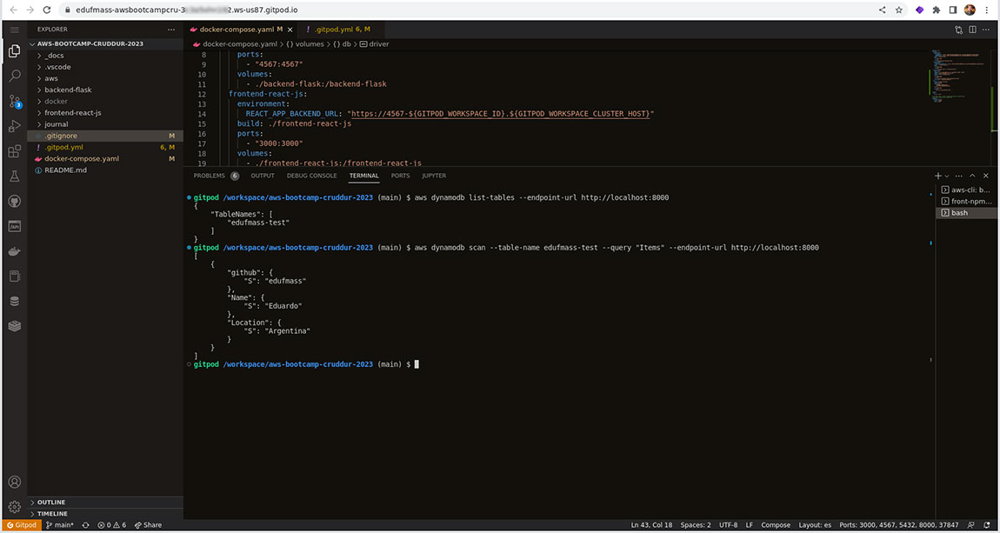

# Week 1 - App Containerization

## General description

This week we will run Cruddur application with containers using Docker platform.

## Homework

- [x] Create a new GitHub repo. Done for week 0.
- [x] [Launch the repo within a Gitpod workspace](#launch-the-repo-within-a-gitpod-workspace).
- [x] [Configure Gitpod.yml configuration, eg. VSCode Extensions](#configure-gitpodyml-configuration-eg-vscode-extensions).
- [x] [Clone the frontend and backend repo](#clone-the-frontend-and-backend-repo).
- [x] Explore the codebases.
- [x] [Ensure we can get the apps running locally](#ensure-we-can-get-the-apps-running-locally).
- [x] [Write a Dockerfile for each app](#write-a-dockerfile-for-each-app).
- [x] [Ensure we get the apps running via individual container](#ensure-we-can-get-the-apps-running-locally).
- [x] [Create a docker-compose file to run multiple containers side by side](#create-a-docker-compose-file-to-run-multiple-containers-side-by-side).
- [x] [Mount directories so we can make changes while we code](#volumes).
- [x] [Container Security Considerations](#container-security-considerations).
- [x] [Document the Notification Endpoint for the OpenAI Document](#document-the-notification-endpoint-for-the-openai-document).
- [x] [Write a Flask Backend Endpoint for Notifications](#write-a-flask-backend-endpoint-for-notifications).
- [x] [Write a React Page for Notifications](#write-a-react-page-for-notifications).
- [x] [Run PostgreSQL and DynamoDB Local Container](#run-postgresql-and-dynamodb-local-container).
- - [x] [Test PostgreSQL](#test-postgresql).
- - [x] [Test DynamoDB Local](#test-dynamodb-local).
- [x] [Run the dockerfile CMD as an external script](#run-the-dockerfile-cmd-as-an-external-script).
- [x] [Push and tag a image to DockerHub](#push-and-tag-a-image-to-dockerhub).
- [x] [Use multi-stage building for a Dockerfile build](#use-multi-stage-building-for-a-dockerfile-build).
- [x] [Implement a healthcheck in the V3 Docker compose file](#implement-a-healthcheck-in-the-v3-docker-compose-file)
- - [X] [SOLVED] [Problem with backend container healthcheck](#problem-with-backend-container-healthcheck).
- [x] Research best practices of Dockerfiles and attempt to implement it in your Dockerfile
- [x] [Install Docker on your localmachine and get the same containers running](#install-docker-on-your-localmachine-and-get-the-same-containers-running).
- [x] [Launch an EC2 instance, install docker, pull a container and run docker processes](#launch-an-ec2-instance-install-docker-pull-a-container-and-run-docker-processes).


## Launch the repo within a Gitpod workspace.

Gitpod is a cloud development environment for develop software.<br>
To use GitPod you have to navigate to your project's GitHub and prefix the entire url with **gitpod.io/#**.

```
https://gitpod.io/#https://github.com/edufmass/aws-bootcamp-cruddur-2023
```

This will launch gitpod workspace with your github repository:


[Go to first steps](#homework)

## Configure Gitpod.yml configuration, eg. VSCode Extensions

We can configure and perform tasks when workspace is created.<br><br>
Tasks and extensions are defined in .gitpod.yml file, in the example there are some tasks to perform installation of aws-cli, install node modules of react application and install PostgreSQL client:

```
tasks:
  - name: aws-cli
    env:
      AWS_CLI_AUTO_PROMPT: on-partial
    init: |
      cd /workspace
      curl "https://awscli.amazonaws.com/awscli-exe-linux-x86_64.zip" -o "awscliv2.zip"
      unzip awscliv2.zip
      sudo ./aws/install
      cd $THEIA_WORKSPACE_ROOT
  - name: front-npm-i
    command: |
      cd $THEIA_WORKSPACE_ROOT/frontend-react-js
      npm i
      cd $THEIA_WORKSPACE_ROOT
  - name: postgres
    init: |
      curl -fsSL https://www.postgresql.org/media/keys/ACCC4CF8.asc|sudo gpg --dearmor -o /etc/apt/trusted.gpg.d/postgresql.gpg
      echo "deb http://apt.postgresql.org/pub/repos/apt/ `lsb_release -cs`-pgdg main" | sudo tee /etc/apt/sources.list.d/pgdg.list
      sudo apt update
      sudo apt install -y postgresql-client-13 libpq-dev
```

Here we configure extensions to be added to Visual Studio Code IDE:
```
vscode:
  extensions:
    - 42Crunch.vscode-openapi
    - ms-azuretools.vscode-docker
    - ms-python.python
    - cweijan.vscode-postgresql-client2
```


### Visual Studio Code web version

If Visual Studio Code web version is selected as IDE we can apply some IDE configurations like we do in Visual Studio Code desktop version.<br>
By default doesn't exists a configuration file, we have to create **.vscode** directory and place inside a **settings.json** file.

```
{
    "explorer.autoReveal": false,
    "workbench.editor.enablePreview": false,
    "workbench.editor.enablePreviewFromQuickOpen": false,
    "workbench.tree.indent": 25,
    "workbench.tree.renderIndentGuides": "always",
    "workbench.colorCustomizations": {
        "tree.indentGuidesStroke": "#f55fed"
    }
}
```


[Go to first steps](#homework)

## Clone the frontend and backend repo

GitPod as an IDE linked to a GitHub repo clones it automatically.<br>
In a personal computer repo is cloned with this command:

```
// using http
$ git clone https://github.com/edufmass/aws-bootcamp-cruddur-2023.git

// using ssh
$ git clone git@github.com:edufmass/aws-bootcamp-cruddur-2023.git
```

[Go to first steps](#homework)


## Ensure we can get the apps running locally

### Backend

To test **backend-flask** we need to install some requirements, to avoid installing them globally we are going to use a python environment.<br>
We create an environment with this command:

```
$ python3 -m venv venv
```
The first **venv** is the name of the Python virtual environment package. The second **venv** is the virtual environment name. Name can be changed.<br>
<br>
Then we need to activate the environment to start working inside it:
```
$ source venv/bin/activate
(venv) $ 
```
Now inside the environment we proceed to set ENV vars needed, install requeriments and run application:
```
(venv) $ export FRONTEND_URL="*"
(venv) $ export BACKEND_URL="*"
pip3 install -r requirements.txt
(venv) $ python3 -m flask run --host=0.0.0.0 --port=4567
```

Enable GitPod port and open the link for 4567 in your browser with **/api/activities/home** to test backend application.


### Frontend

To test **frontend-react-js** we need to install npm modules, set ENV var needed and run application::

```
$ npm i
$ set REACT_APP_BACKEND_URL="https://4567-${GITPOD_WORKSPACE_ID}.${GITPOD_WORKSPACE_CLUSTER_HOST}"
$ npm start
```

Enable GitPod port and open the link for 3000 in your browser to test frontend application.


[Go to first steps](#homework)

## Write a Dockerfile for each app

### Backend

For backend we create **backend-flask/Dockerfile** ([commit](https://github.com/edufmass/aws-bootcamp-cruddur-2023/blob/ea57f5f51cae91e237bee60137a3b6722d23cae5/backend-flask/Dockerfile)):

```
FROM python:3.10-slim-buster

WORKDIR /backend-flask

COPY requirements.txt requirements.txt
RUN pip3 install -r requirements.txt

COPY . .

ENV FLASK_ENV=developent

EXPOSE ${PORT}
# python3 -m flask run --host=.0.0.0.0 --port=4567
CMD ["python3", "-m", "flask", "run", "--host=0.0.0.0", "--port=4567"]
```

### Frontend

For frontend we create **frontend-react-js/Dockerfile** ([commit](https://github.com/edufmass/aws-bootcamp-cruddur-2023/blob/ea57f5f51cae91e237bee60137a3b6722d23cae5/frontend-react-js/Dockerfile)):

```
FROM node:16.18

ENV PORT=3000

COPY . /frontend-react-js
WORKDIR /frontend-react-js
RUN npm install
EXPOSE ${PORT}
CMD ["npm", "start"]
```

### Using docker with containers (backend as example)

We build the container:
```
$ docker build -t backend-flask .
```
We run the container without ENV vars (--rm will remove container when it stop):
```
$ docker run --rm -p 4567:4567 -e FRONTEND_URL='*' -e BACKEND_URL='*' backend-flask
```
We run the container with ENV vars:
```
$ export FRONTEND_URL="*"
$ export BACKEND_URL="*"
$ docker run --rm -p 4567:4567 -e FRONTEND_URL -e BACKEND_URL backend-flask
```
If we want to run the container in background (detach mode) we use **-d** option:
```
$ docker run --rm -p 4567:4567 -e FRONTEND_URL='*' -e BACKEND_URL='*' -d backend-flask
```
We list running containers:
```
$ docker ps
```
We list all containers:
```
$ docker ps -a
```
From list we can see the container ID and Name.<br>
Stop container:
```
$ docker stop ID
$ docker stop Name
```
Delete container:
```
$ docker rm ID
$ docker rm Name
```
We can store ID in ENV var:
```
$ BACKEND_ID=$(docker run --rm -p 4567:4567 -e FRONTEND_URL='*' -e BACKEND_URL='*' backend-flask)
$ echo $BACKEND_ID
```
Get access to a running container:
```
$ docker exec -it ID /bin/bash
$ docker exec -it Name /bin/bash
```

### Using docker with images

Images belongs to a Repository (name) and have a tag for versioning.<br>
* name:tag
* python:2.7.7
* python:3.7
* python:3.9.16

To retrieve an image from Docker Hub:
```
$ docker pull python
$ docker pull python:2.7.7
$ docker pull python:3.9.16
```
> If no tag is specified, Docker will use **latest**. It is bad practice not to specify a tag. Imagine *software_name* version 1.0 is safe to use and then version 2.0 is added with bugs. If our Dockerfiles pull *software_name* without a tag, at some point we'll get the latest 2.0 that will generate bad behavior in our work.

We list images:
```
$ docker images
```
From list we can see the image ID, Name and Tag.<br>
We can deleten an image:
```
$ docker image rm Name:tag
$ docker rmi Name:tag
$ docker image rm ID
$ docker rmi ID
```

[Go to first steps](#homework)

## Create a docker-compose file to run multiple containers side by side
In this project we have backend and frontend applications that are executed individually each one from its Dockerfile.<br>
We can orchestrate execution in conjunction with the use of **Docker compose**.

### docker-compose.yml
Create a **docker-compose.yml** file in root directory of the project ([commit](https://github.com/edufmass/aws-bootcamp-cruddur-2023/blob/ea57f5f51cae91e237bee60137a3b6722d23cae5/docker-compose.yaml)):

```
version: "3.8"
services:
  backend-flask:
    environment:
      FRONTEND_URL: "https://3000-${GITPOD_WORKSPACE_ID}.${GITPOD_WORKSPACE_CLUSTER_HOST}"
      BACKEND_URL: "https://4567-${GITPOD_WORKSPACE_ID}.${GITPOD_WORKSPACE_CLUSTER_HOST}"
    build: ./backend-flask
    ports:
      - "4567:4567"
    volumes:
      - ./backend-flask:/backend-flask
  frontend-react-js:
    environment:
      REACT_APP_BACKEND_URL: "https://4567-${GITPOD_WORKSPACE_ID}.${GITPOD_WORKSPACE_CLUSTER_HOST}"
    build: ./frontend-react-js
    ports:
      - "3000:3000"
    volumes:
      - ./frontend-react-js:/frontend-react-js

# the name flag is a hack to change the default prepend folder
# name when outputting the image names
networks: 
  internal-network:
    driver: bridge
    name: cruddur
```

### Volumes

Volumes map local directory with directory inside container. We can persist data if the container is destroyed and we can update our projects files without having to rebuild the image that a container uses. Sometimes we just need to restart it.

[Go to first steps](#homework)


## Container Security Considerations
After watching the video about security considerations we analized the project with Snyk tool. ([snyk.io](https://snyk.io/))

First we sign up and link to our github account to select a repository.


In dashboard we can see a resume of the status of our project.


Then in detail we can see the suggestions to fix our security issues.
For example change a image version: ([commit](https://github.com/edufmass/aws-bootcamp-cruddur-2023/blob/3625332e71682cb65771c55521356d5bf7f2713c/frontend-react-js/Dockerfile))

```
#FROM node:16.18 -> Removed by Snyk recommendation
FROM node:19.6.0-bullseye-slim

ENV PORT=3000

COPY . /frontend-react-js
WORKDIR /frontend-react-js
RUN npm install
EXPOSE ${PORT}
CMD ["npm", "start"]
```

After applying the suggestions, the security of our project improved.


[Go to first steps](#homework)


## Document the Notification Endpoint for the OpenAI Document

For notifications **/api/activities/notifications/** endpoint will be used.<br>
We add the details in **/backend-flask/openapi-3.0.yml** : ([commit](https://github.com/edufmass/aws-bootcamp-cruddur-2023/blob/a6362c0f36157f1a7c40ef881a262ffcbab5992e/backend-flask/openapi-3.0.yml))


```
/api/activities/notifications:
    get:
      description: 'Return a feed of activity for all users I follow'
      tags:
        - activities
      responses:
        '200':
          description: Returns an array of activities
          content:
            application/json:
              schema:
                type: array
                items:
                  $ref: '#/components/schemas/Activity'
```


[Go to first steps](#homework)

## Write a Flask Backend Endpoint for Notifications
To implement the endpoint we have to create the service and the route.<br>

Modify **/backend-flask/app.py**: ([commit](https://github.com/edufmass/aws-bootcamp-cruddur-2023/blob/a6362c0f36157f1a7c40ef881a262ffcbab5992e/backend-flask/app.py))

```
from services.notifications_activities import *

@app.route("/api/activities/notifications", methods=['GET'])
def data_notifications():
  data = NotificationsActivities.run()
  return data, 200
```

Add **/backend-flask/services/notifications_activities.py**: ([commit](https://github.com/edufmass/aws-bootcamp-cruddur-2023/blob/a6362c0f36157f1a7c40ef881a262ffcbab5992e/backend-flask/services/notifications_activities.py))

```
from datetime import datetime, timedelta, timezone
class NotificationsActivities:
  def run():
    now = datetime.now(timezone.utc).astimezone()
    results = [{
      'uuid': '68f126b0-1ceb-4a33-88be-d90fa7109eee',
      'handle':  'Coco',
      'message': 'I am a white unicorn!',
      'created_at': (now - timedelta(days=2)).isoformat(),
      'expires_at': (now + timedelta(days=5)).isoformat(),
      'likes_count': 5,
      'replies_count': 1,
      'reposts_count': 0,
      'replies': [{
        'uuid': '26e12864-1c26-5c3a-9658-97a10f8fea67',
        'reply_to_activity_uuid': '68f126b0-1ceb-4a33-88be-d90fa7109eee',
        'handle':  'Worf',
        'message': 'This post has no honor!',
        'likes_count': 0,
        'replies_count': 0,
        'reposts_count': 0,
        'created_at': (now - timedelta(days=2)).isoformat()
      }],
    }
    ]
    return results
```

[Go to first steps](#homework)

## Write a React Page for Notifications
To implement the Notifications page we have to create the notification page, notification css and the route.<br>

Modify **/frontend-react-js/src/App.js**: ([commit](https://github.com/edufmass/aws-bootcamp-cruddur-2023/blob/a6362c0f36157f1a7c40ef881a262ffcbab5992e/frontend-react-js/src/App.js))

```
import NotificationsFeedPage from './pages/NotificationsFeedPage';

const router = createBrowserRouter([
  ...
  ...
  {
    path: "/notifications",
    element: <NotificationsFeedPage />
  },
  ...
  ...
]);
```

Add **/frontend-react-js/src/pages/NotificationsFeedPage.css**: ([commit](https://github.com/edufmass/aws-bootcamp-cruddur-2023/blob/a6362c0f36157f1a7c40ef881a262ffcbab5992e/frontend-react-js/src/pages/NotificationsFeedPage.css))

```
article {
    display: flex;
    flex-direction: row;
    justify-content: center;
}
```

Add **/frontend-react-js/src/pages/NotificationsFeedPage.js**: ([commit](https://github.com/edufmass/aws-bootcamp-cruddur-2023/blob/a6362c0f36157f1a7c40ef881a262ffcbab5992e/frontend-react-js/src/pages/NotificationsFeedPage.js))

```
import './NotificationsFeedPage.css';
import React from "react";

import DesktopNavigation  from '../components/DesktopNavigation';
import DesktopSidebar     from '../components/DesktopSidebar';
import ActivityFeed from '../components/ActivityFeed';
import ActivityForm from '../components/ActivityForm';
import ReplyForm from '../components/ReplyForm';

// [TODO] Authenication
import Cookies from 'js-cookie'

export default function NotificationsFeedPage() {
  const [activities, setActivities] = React.useState([]);
  const [popped, setPopped] = React.useState(false);
  const [poppedReply, setPoppedReply] = React.useState(false);
  const [replyActivity, setReplyActivity] = React.useState({});
  const [user, setUser] = React.useState(null);
  const dataFetchedRef = React.useRef(false);

  const loadData = async () => {
    try {
      const backend_url = `${process.env.REACT_APP_BACKEND_URL}/api/activities/notifications`
      const res = await fetch(backend_url, {
        method: "GET"
      });
      let resJson = await res.json();
      if (res.status === 200) {
        setActivities(resJson)
      } else {
        console.log(res)
      }
    } catch (err) {
      console.log(err);
    }
  };

  const checkAuth = async () => {
    console.log('checkAuth')
    // [TODO] Authenication
    if (Cookies.get('user.logged_in')) {
      setUser({
        display_name: Cookies.get('user.name'),
        handle: Cookies.get('user.username')
      })
    }
  };

  React.useEffect(()=>{
    //prevents double call
    if (dataFetchedRef.current) return;
    dataFetchedRef.current = true;

    loadData();
    checkAuth();
  }, [])

  return (
    <article>
      <DesktopNavigation user={user} active={'notifications'} setPopped={setPopped} />
      <div className='content'>
        <ActivityForm  
          popped={popped}
          setPopped={setPopped} 
          setActivities={setActivities} 
        />
        <ReplyForm 
          activity={replyActivity} 
          popped={poppedReply} 
          setPopped={setPoppedReply} 
          setActivities={setActivities} 
          activities={activities} 
        />
        <ActivityFeed 
          title="Notifications" 
          setReplyActivity={setReplyActivity} 
          setPopped={setPoppedReply} 
          activities={activities} 
        />
      </div>
      <DesktopSidebar user={user} />
    </article>
  );
}
```

[Go to first steps](#homework)


## Run PostgreSQL and DynamoDB Local Container

Edit **docker-compose.yaml** to add PostgreSQL and DynamoDB Local: ([commit](https://github.com/edufmass/aws-bootcamp-cruddur-2023/blob/f88bc444f314aef7c68f3edac867e5d99c121d68/docker-compose.yaml))

```
version: "3.8"
services:
  dynamodb-local:
    user: root
    command: "-jar DynamoDBLocal.jar -sharedDb -dbPath ./data"
    image: "amazon/dynamodb-local:latest"
    container_name: dynamodb-local
    ports:
      - "8000:8000"
    volumes:
      - "./docker/dynamodb:/home/dynamodblocal/data"
    working_dir: /home/dynamodblocal
  db:
    image: postgres:13-alpine
    restart: always
    environment:
      - POSTGRES_USER=postgres
      - POSTGRES_PASSWORD=password
    ports:
      - '5432:5432'
    volumes: 
      - db:/var/lib/postgresql/data

volumes:
  db:
    driver: local
```

Run:

```
$ docker compose up
```

Verify that services started correctly. PostgreSQL on port 5432 and DynamoDB Local on port 8000:


[Go to first steps](#homework)

### Test PostgreSQL

PostgreSQL client was installed with gitpod configuration in [.gitpod.yml](#configure-gitpodyml-configuration-eg-vscode-extensions)

Connect to PostgreSQL with user=postgres and password=password:

```
$ psql -h localhost -U postgres
```


[Go to first steps](#homework)

### Test DynamoDB Local

First we create a table:

```
$ aws dynamodb create-table \
    --endpoint-url http://localhost:8000 \
    --table-name edufmass-test \
    --attribute-definitions \
        AttributeName=Name,AttributeType=S \
        AttributeName=Location,AttributeType=S \
    --key-schema AttributeName=Name,KeyType=HASH AttributeName=Location,KeyType=RANGE \
    --provisioned-throughput ReadCapacityUnits=1,WriteCapacityUnits=1 \
    --table-class STANDARD
```


Next we insert an item:

```
$ aws dynamodb put-item \
    --endpoint-url http://localhost:8000 \
    --table-name edufmass-test \
    --item \
        '{"Name": {"S": "Eduardo"}, "Location": {"S": "Argentina"}, "github": {"S": "edufmass"}}' \
    --return-consumed-capacity TOTAL  
```


Then we list tables and query items:

```
$ aws dynamodb list-tables --endpoint-url http://localhost:8000

$ aws dynamodb scan --table-name edufmass-test --query "Items" --endpoint-url http://localhost:8000
```



[Go to first steps](#homework)

## Run the dockerfile CMD as an external script

### Backend

First create **/backend-flask/backend.sh** file: ([commit](https://github.com/edufmass/aws-bootcamp-cruddur-2023/blob/68567dace33fd6664b510fa6a02873b316855c52/backend-flask/backend.sh))

```
#!/bin/sh
python3 -m flask run --host=0.0.0.0 --port=4567
```

Docker uses it's own file system but it copies everything over (including permissions bits) from the source directories. Change permission:
```
$ chmod +x backend.sh
```

Update **/backend-flask/Dockerfile** file: ([commit](https://github.com/edufmass/aws-bootcamp-cruddur-2023/blob/68567dace33fd6664b510fa6a02873b316855c52/backend-flask/Dockerfile))

```
#FROM python:3.10-slim-buster -> Removed by Snyk recommendation
FROM python:3.12.0a5-slim

WORKDIR /backend-flask

COPY requirements.txt requirements.txt
RUN pip3 install -r requirements.txt

COPY . .

ENV FLASK_ENV=developent

EXPOSE ${PORT}
#python3 -m flask run --host=.0.0.0.0 --port=4567
#CMD ["python3", "-m", "flask", "run", "--host=0.0.0.0", "--port=4567"]
RUN chmod +x backend.sh
RUN ./backend.sh
```

### Frontend

First create **/frontend-react-js/frontend.sh** file: ([commit](https://github.com/edufmass/aws-bootcamp-cruddur-2023/blob/68567dace33fd6664b510fa6a02873b316855c52/frontend-react-js/frontend.sh))

```
#!/bin/sh
npm start
```

Docker uses it's own file system but it copies everything over (including permissions bits) from the source directories. Change permission:
```
$ chmod +x frontend.sh
```

Update **/backend-flask/Dockerfile** file: ([commit](https://github.com/edufmass/aws-bootcamp-cruddur-2023/blob/68567dace33fd6664b510fa6a02873b316855c52/frontend-react-js/Dockerfile))

```
#FROM node:16.18 -> Removed by Snyk recommendation
#FROM node:19.6.0-bullseye-slim
FROM node:19.6.1

WORKDIR /frontend-react-js

ENV PORT=3000

COPY . /frontend-react-js

RUN npm install
EXPOSE ${PORT}

#CMD ["npm", "start"]
RUN chmod +x frontend.sh
RUN ./frontend.sh
```

[Go to first steps](#homework)

## Push and tag a image to DockerHub

After the desired image is created locally, run **docker tag** command:

```
$ docker tag name:tag docker_username/name:tag

$ docker tag aws-cruddur-2023-frontend-react-js:latest edufmass/cruddur-2023-frontend:1.0
$ docker tag aws-cruddur-2023-backend-flask:latest edufmass/cruddur-2023-backend:1.0
```


Login into Docker hub from command line:

```
$ docker login
```


Push an image to Docker hub:

```
$ docker push edufmass/cruddur-2023-frontend:1.0
$ docker push edufmass/cruddur-2023-backend:1.0
```


In browser go to **hub.docker.com/repositories/[your_username]**


Lastly for safety logout from docker:

```
$ docker logout
```


[Go to first steps](#homework)


## Use multi-stage building for a Dockerfile build

Multi-stage: [docs.docker.com/build/building/multi-stage](https://docs.docker.com/build/building/multi-stage/)

>With multi-stage builds, you use multiple FROM statements in your Dockerfile. Each FROM instruction can use a different base, and each of them begins a new stage of the build. You can selectively copy artifacts from one stage to another, leaving behind everything you don't want in the final image.

> **Multi-stage is part of best practices of Dockerfiles**

Multi-stage will be used to reduce size of frontend image, leaving behind all stuff required to build react application.<br>

<br>

Before configuring multi-stage lets check the size of the images. Frontend image size is **1.24GB**:


Change the execution of react application into build application.<br>
Update **/frontend-react-js/frontend.sh**: [commit](https://github.com/edufmass/aws-bootcamp-cruddur-2023/blob/af3e60b0f5bf8e8201be0898f5ab200e52215d28/frontend-react-js/frontend.sh)

```
#!/bin/sh
#npm start
npm run build
```

Since we changed execution into building, the app will not be served by *npm start*. Now Nginx will serve the application using the built app from previous stage.<br>
Update **/frontend-react-js/Dockerfile**: [commit](https://github.com/edufmass/aws-bootcamp-cruddur-2023/blob/af3e60b0f5bf8e8201be0898f5ab200e52215d28/frontend-react-js/Dockerfile)

```
#FROM node:16.18 -> Removed by Snyk recommendation
#FROM node:19.6.0-bullseye-slim
FROM node:19.6.1 as build

WORKDIR /frontend-react-js

ENV PORT=3000
ENV REACT_APP_BACKEND_URL="https://4567-${GITPOD_WORKSPACE_ID}.${GITPOD_WORKSPACE_CLUSTER_HOST}"

COPY . /frontend-react-js

RUN npm install
EXPOSE ${PORT}

#CMD ["npm", "start"]
RUN chmod +x frontend.sh
RUN ./frontend.sh

FROM nginx
EXPOSE 3000
COPY ./nginx/default.conf /etc/nginx/conf.d/default.conf
COPY --from=build /frontend-react-js/build /usr/share/nginx/html
```

Create **/frontend-react-js/nginx/** folder and **/frontend-react-js/nginx/default.conf** file: [commit](https://github.com/edufmass/aws-bootcamp-cruddur-2023/blob/af3e60b0f5bf8e8201be0898f5ab200e52215d28/frontend-react-js/nginx/default.conf)

```
server {
    listen 3000 default_server;
    listen [::]:3000 default_server; 
    root /usr/share/nginx/html;  
    index index.html; 
    server_name _;  
    location / {
       try_files $uri $uri/ =404;
     }
}
```

Now build and test new configurations (delete previous images with *docker rmi*):

```
$ docker compose up
```


Now lets check the size of the images. Frontend image size is **144MB**:


[Go to first steps](#homework)

## Implement a healthcheck in the V3 Docker compose file

Update **docker-compose.yaml** to add healthcheck of frontend container: [commit](https://github.com/edufmass/aws-bootcamp-cruddur-2023/blob/51042ffbf18a7ddfff06ec9292a9e74fbd79fff9/docker-compose.yaml)

```
frontend-react-js:
    environment:
      REACT_APP_BACKEND_URL: "https://4567-${GITPOD_WORKSPACE_ID}.${GITPOD_WORKSPACE_CLUSTER_HOST}"
    build: ./frontend-react-js
    ports:
      - "3000:3000"
    volumes:
      - ./frontend-react-js:/frontend-react-js
    healthcheck:
      test: curl --fail https://3000-${GITPOD_WORKSPACE_ID}.${GITPOD_WORKSPACE_CLUSTER_HOST} || exit 1
      interval: 60s
      retries: 5
      start_period: 20s
      timeout: 10s
```

In the screenshot you can see that after a moment the container is tested to detect if it respond to curl test. The container respond that request so is marked as healthy.


[Go to first steps](#homework)

### Problem with backend container healthcheck

I updated **docker-compose.yaml** to add healthcheck of backend container: [commit](https://github.com/edufmass/aws-bootcamp-cruddur-2023/blob/4b5604457b3eff3f0db08fc83251ec94f36be365/docker-compose.yaml)

```
 backend-flask:
    environment:
      FRONTEND_URL: "https://3000-${GITPOD_WORKSPACE_ID}.${GITPOD_WORKSPACE_CLUSTER_HOST}"
      BACKEND_URL: "https://4567-${GITPOD_WORKSPACE_ID}.${GITPOD_WORKSPACE_CLUSTER_HOST}"
    build: ./backend-flask     
    ports:
      - "4567:4567"
    volumes:
      - ./backend-flask:/backend-flask
    healthcheck:
      test: curl --fail https://4567-${GITPOD_WORKSPACE_ID}.${GITPOD_WORKSPACE_CLUSTER_HOST}/api/activities/home || exit 1
      interval: 60s
      retries: 5
      start_period: 20s
      timeout: 10s
```

I was getting unhealthy and couldn't understand why because the container did work.


After reading a lot I came across the following command:

```
$ docker inspect --format "{{json .State.Health }}" [container_name] | jq

$ docker inspect --format "{{json .State.Health }}" aws-bootcamp-cruddur-2023-backend-flask-1 | jq
```


I discovered that I had a problem with **curl** in backend container.<br>
I updated **/backend-flask/Dockerfile** to install curl in the container: [commit](https://github.com/edufmass/aws-bootcamp-cruddur-2023/blob/4b5604457b3eff3f0db08fc83251ec94f36be365/backend-flask/Dockerfile)

```
#FROM python:3.10-slim-buster -> Removed by Snyk recommendation
FROM python:3.12.0a5-slim

RUN apt-get update \
 && apt-get install -y curl
WORKDIR /backend-flask

COPY requirements.txt requirements.txt
RUN pip3 install -r requirements.txt

COPY . .

ENV FLASK_ENV=developent

EXPOSE ${PORT}
#python3 -m flask run --host=.0.0.0.0 --port=4567
CMD ["python3", "-m", "flask", "run", "--host=0.0.0.0", "--port=4567"]
#RUN chmod +x backend.sh
#RUN ./backend.sh
```


After running docker compose I could health check both containers with success:


## Install Docker on your localmachine and get the same containers running

Steps to install docker in localmachine using Debian Linux :

```
$ sudo apt install ca-certificates curl gnupg lsb-release

$ sudo mkdir -m 0755 -p /etc/apt/keyrings

$ curl -fsSL https://download.docker.com/linux/debian/gpg | sudo gpg --dearmor -o /etc/apt/keyrings/docker.gpg

$ echo "deb [arch=$(dpkg --print-architecture) signed-by=/etc/apt/keyrings/docker.gpg] https://download.docker.com/linux/debian \
   $(lsb_release -cs) stable" | sudo tee /etc/apt/sources.list.d/docker.list > /dev/null

$ sudo apt update

$ sudo apt-get install docker-ce docker-ce-cli containerd.io docker-buildx-plugin docker-compose-plugin
```

After installing docker you can add your user to **docker** group to run it without sudo:

```
$ usermod -aG docker [your_user]
```

Now you can test your project in localmachinte:


[Go to first steps](#homework)

## Launch an EC2 instance, install docker, pull a container and run docker processes

EC2 instance is created in AWS Console:


Update security to enable some inboung rules.<br>
Open TCP port 80 to be able to serve react page by nginx.<br>
Open port 4567 to be able to serve api endpoints by flask.


Login into EC2 using **[key].pem** file created in AWS Console:

```
$ ssh -i "[file_key].pem" [user]@[ec2-instance-domain]
```


Docker is installed following the same [steps](#install-docker-on-your-localmachine-and-get-the-same-containers-running) followed for install in localmachine. EC2 instance has Debian Linux installed.<br>

<br>

Then pull images previously uploaded into Docker hub:

```
$ docker pull [image_name]:[tag]
```


Create **docker-compose.yaml** to manage the execution of the containers:


Run docker compose in detach mode:

```
$ docker compose up -d
```


Verify that application is running in AWS EC2 instance:


[Go to first steps](#homework)
